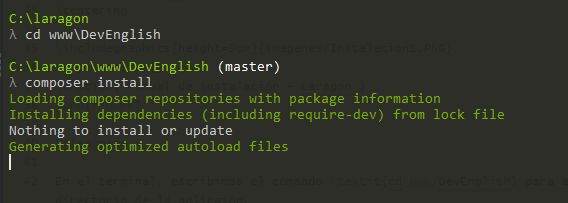

 

<h1>Demostración de la aplicación </h1>

En la pantalla de inicio se detallan las características de la aplicación, indicando que ofrece, junto con un formulario de contacto.

 

 

<h3>Estudiante </h3>

Para poder hacer uso de la aplicación como un estudiante, se debe de registrar la cuenta nueva, para ello selecciona la opción  ``Regístrate'' en el menú y completa el formulario de la pantalla de registro.

 

 

Haciendo click sobre nuestro nombre de usuario en el menú y seleccionando ajustes accederemos a la pantalla de ajustes.

 

En esta pantalla podremos cambiar todos los datos de nuestro perfil (Siempre y cuando no exista otro usuario registrado en el sistema con ese nombre o email). En esta pantalla podemos cambiar nuestro avatar, visible en las pantallas de foro, progreso y chat.

En la pantalla de temarios se nos muestra una lista con todos los temarios de la aplicación, podemos suscribirnos o cancelar la suscripción de los distintos temarios, además de acceder a la información y pruebas de los temarios a los que ya estemos suscritos.

 

En la pantalla de información encontramos los distintos términos, links y vídeos del temario.

 

 

 

Al acceder a la pantalla de pruebas, se nos muestran las pruebas del temario divididas en sus tipos.

 

Hacemos click en el nombre de la prueba que deseemos para poder realizarla. A continuación se muestran los distintos tipos de pruebas, para cada uno existe una pantalla en especifico.

 

 

 

 

 

En la pantalla ``Mi progreso'' podemos observar la información relevante a nuestra cuenta de usuario, una tabla con las pruebas realizadas (Temario, nombre, aciertos, fallos, porcentaje de puntuación), tabla con los posts creados y los temarios a los que estamos suscritos. Esta pantalla es accesible por todos los usuarios de la aplicación.

 

La pantalla ``Consultas'' nos muestra una lista con las consultas realizadas con nuestra cuenta y la opción de realizar una nueva consulta. Al hacer click en el nombre de una consulta accederemos a la pantalla de chat de esa consulta, las consultas resueltas estan resaltadas de color verde, se muestran el numero de mensajes no leidos de una consulta en la esquina superior del avatar del temario de esa consulta.

 

En la pantalla ``Foro'' podemos ver una lista con los distintos posts creados por los usuarios de la aplicación y podemos crear uno nuevo.

 

 

<h3>Administrador</h3>

Al autenticarnos con una cuenta de administrador, accederemos al panel de administración. Desde este panel podemos gestionar todos los recursos de la aplicación.

 

A la hora de intentar eliminar un elemento, se nos muestra un modal de confirmación.

 

En la pantalla temarios, podemos ver una lista con los diferentes temarios en el sistema con su nombre, imagen y si esta activo o no. Para cada temario podemos verlo, editarlo o eliminarlo. Además se nos ofrece la opción de crear un nuevo temario

 

 

Al hacer click en  el botón Asignar Profesor, se nos muestra un modal con una lista de los profesores disponibles y un botón Asignar junto a cada uno para asignarlo a este temario.

 

La pantalla de términos nos muestra una lista con los términos almacenados en el sistema y los temarios a los que pertenecen, podemos ver, editar, borrar o crear un nuevo termino.

 

En la pantalla usuarios podemos ver una lista con los usuarios registrados en el sistema, con sus tipos, nombres, email, avatar y si esta activo o no. Desde esta pantalla podemos ver, editar o activar/desactivar un usuario.

 

En la pantalla pruebas se nos muestra una lista con las pruebas guardadas en el sistema, junto con el temario al que pertenecen y su estado.

 

 

 

 

 

 

Se nos muestra una lista de las consultas realizadas junto con el temario al que pertenecen y el usuario que la ha creado. Tenemos la opción de marcarla como resuelta o de acceder a la pantalla de chat para consultarla o responder.

 

 

<h3>Tutor</h3>

Al autenticarnos con una cuenta de tutor, accederemos al panel de administración para tutores. En este panel se nos muestra una lista con los temarios a los que está asignado el tutor de la cuenta, tenemos la opción de consultar/editar el temario, gestionar las pruebas, gestionar los recursos y términos, y acceder a las consultas del temario

 

 

<h1>Requisitos previos</h1>

El siguiente manual esta enfocado para ejecutar la aplicación en el sistema operativo Windows, por lo que el requisito previo será tener una maquina con Windows 10

<h3>Inventario de componentes</h3>

Para ejecutar la aplicación, necesitaremos instalar y/o descargar los siguientes componentes:

1.  <a href="https://laragon.org/download/" target="_blank">Laragon</a>

<h3> Procedimientos de instalación</h3>

En primer lugar, descargaremos Laragon desde su página oficial y lo instalaremos en nuestra maquina.

Ejecutamos Laragon y seleccionamos Iiciar Todo y abrimos un nuevo terminal.

 

En el terminal, escribimos el comandocd www/DevEnglishpara acceder al directorio de la aplicaión.

 

Una vez ubicados en el directorio de la aplicación, con el comando composer install, instalamos lasdependencias necesarias (Este proceso puede tardar unos minutos).

 

En el navegador, accedemos al panel de phpmyadmin mediante la url:http://localhost/phpmyadmin/index.php,seleccionamos la opciónNewy asignamos el nombredevenglisha la base de datos que crearemos. Oen su defecto, importamos la base de datosdevenglish.slqlocalizada en el directorio de este proyecto.

 

En el directorio base de la aplicación (C:/laragon/www/DevEnglish), creamos un fichero llamado .env con la siguiente información (Los campos DB_USERNAME y DB_PASSWORD pueden variar dependiendo del usuario y contraseña de phpmyadmin):

 

A continuación, con los comandosphp artisan migrateyphp artisan db:seed, creamos y rellenamoslas tablas y relaciones en la base de datos (Omitimos este paso si hemos importado la base de datos devenglish.slq del directorio del proyecto).

Con el comando php artisan servese inicia el servidor, si todos los pasos anteriores se han seguido correctamente, podremos acceder a la aplicación mediante la url http://localhost:8000/.

 

Los credenciales para acceder al panel de administración podemos modificarlas antes de usar el comandophp artisan db:seed cambiando la configuración de la semilla de Usuario, esta se encuentra en la carpeta/database/seedsen el archivo UserTableSeeder.php.

 

Cambiando los camposemail y password modificamos las credenciales para el inicio de sesión del administrador.

 

Para hacer administrador a un usuario, cambiamos el campo user_type_id para que su valor sea 1.

